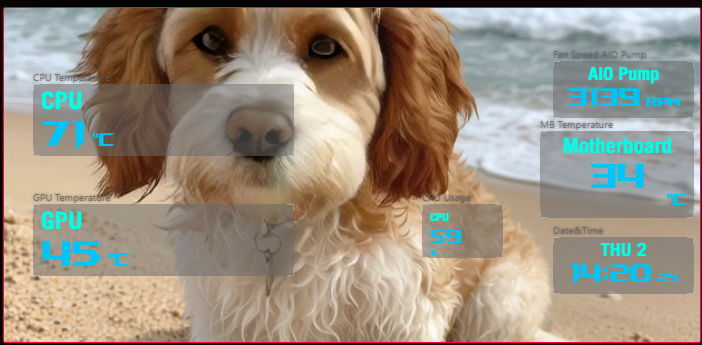
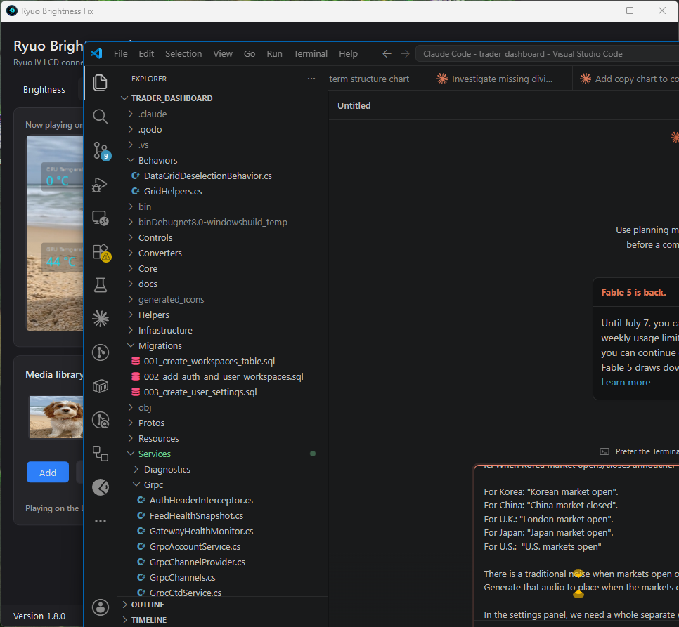
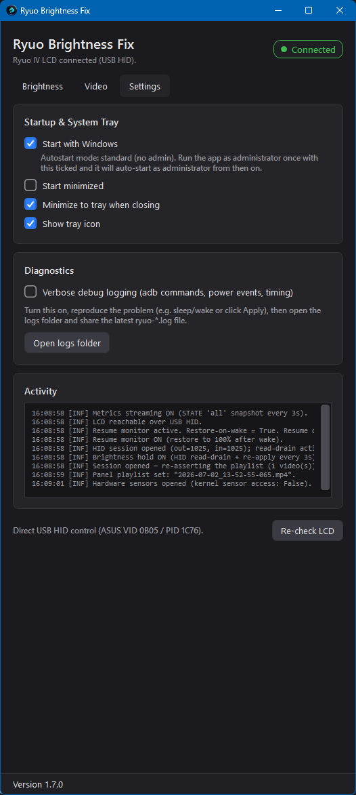

# ASUS Ryuo Commander

Take full control of the **ASUS ROG Ryuo IV** AIO LCD — **brightness that actually holds**
and **any video you like on the panel** — without ASUS Info Hub running.

Two parts (.NET 8), both speaking the panel's **native USB‑HID protocol** directly:

- a **Windows Service** (`RyuoPanelService`, runs as LocalSystem) that keeps the screen alive,
  plays your video, streams metrics, and **heals every failure mode the panel firmware throws
  at it** — automatically, from boot, with no one logged in. The **Service Control Manager**
  restarts it if it ever stops, and it **survives Windows Update** (it comes back on its own,
  no logon required);
- a small **WPF window** to configure it (brightness, video library, metric widgets). When the
  service is installed the window is a thin **client** — it edits settings and shows status and
  never touches the panel itself, so the two never fight over the device.

**Example: a custom video looping on the Ryuo IV at 100% brightness, with live metric
widgets (CPU/GPU temperature, CPU usage, AIO pump RPM, motherboard temperature, clock):**



| Brightness | Video | Settings |
|:---:|:---:|:---:|
|  |  |  |

---

## What it does

- **Holds the LCD at your chosen brightness.** The panel firmware idle‑dims to ~20% a few
  seconds after the PC stops talking to it (that's the infamous "dims after sleep even though
  Armoury Crate says 100%"). The app keeps a live HID session with a read‑drain and re‑applies
  your level every 3 s.
- **Plays your videos on the panel — a whole media library of them.** The Video tab is a
  full Info Hub‑style editor: an **LCD‑shaped screen playing exactly what the cooler shows —
  the video *and* the live metric widgets rendered at their real on‑panel placements** — with
  a **thumbnail media library strip** below it (Add / Remove / reorder, scrollbar under the
  strip) and the three play modes in its header — **Repeat one**, **Repeat all** (in order),
  **Shuffle** — all firmware‑native (`Single`/`Cycle`/`Random`, dug out of Info Hub's own
  source and each verified live). Every added video is transcoded to the panel's playable
  format with your chosen **scale mode** (*Fill* = crop to cover, *Fit* = letterbox,
  *Stretch* = distort) and uploaded; the panel itself rotates the list.
- **Shows live system metrics on the panel.** Up to six widgets over the video (CPU/GPU
  temperature, loads, clocks, fan/pump RPM, motherboard temperature, clock) — the same
  telemetry Info Hub streams, reverse‑engineered (`STATE all` snapshots every 3 s) and fed
  from LibreHardwareMonitor. Picked from **category chips right next to the screen preview**
  (with title/content color controls), and mirrored live onto the preview so you see the
  exact values the cooler is displaying. The service runs as **LocalSystem**, so it always has
  the ring‑0 access CPU temperature and fan RPMs need — no UAC, no "run as administrator" dance.
  (GPU sensors are deliberately off: LibreHardwareMonitor's native NVIDIA path can crash the
  process after a driver reset. A crash would just get an SCM restart now, but not needing one
  is better.)
- **Runs from boot and survives everything.** Installed as a Windows Service, it starts before
  anyone logs in and is supervised by the OS: the **SCM restarts it on failure** (5 s → 30 s →
  60 s backoff) and it **comes back on its own after Windows Update** closes it. Panel reboots,
  USB re‑enumeration, PC sleep, firmware wedges — it detects each and restores both brightness
  *and* your video with no interaction:
  - HID sessions **self‑heal** (failed writes reopen the session and retry);
  - the panel is **re‑detected on USB** (the service polls for arrival/removal);
  - a **wedged firmware is un‑wedged automatically** (see below);
  - **resume from sleep** is caught via the service's `OnPowerEvent`, which then restarts the
    panel's `SerialService` and re‑applies — deterministically, every wake;
  - the **video is re‑asserted** whenever the panel reconnects, because the panel forgets its
    screen config on every reboot and would otherwise sit on a black screen.
- Config UI: brightness, video library, metric widgets, rolling logs — a thin client of the
  service, or a standalone tray app when the service isn't installed.

---

## How we got here (the investigation)

This started from a wrong assumption and was corrected by on‑device reverse engineering and
live testing. The dead ends are documented because they're the obvious‑but‑wrong first
guesses:

1. **sysfs backlight — WRONG.** `/sys/class/backlight/backlight/brightness` (0–256) can be
   written over adb and *reads back* the value, but `actual_brightness` never rises above
   ~13 and the panel doesn't respond. The node is decoupled from what you see.
2. **Android `screen_brightness` — WRONG.** Setting it 10 vs 255 changed nothing on the
   panel. When Info Hub changed brightness, *none* of these values moved.
3. **adb `transfer_proxy` socket — WRONG.** That abstract socket is the Rockchip **RKNN NPU
   video server** (`/vendor/bin/rknn_server`) used for streaming frames to the panel, not
   brightness.
4. **USB HID — CORRECT.** Live `logcat` capture on the (rooted) device showed brightness
   arriving on `/dev/hidg0` from a vendor HID interface, decoded by `SerialService` and
   applied by the home‑UI app. Confirmed by a sender that visibly moved the panel.
5. **Why "Apply" seemed to do nothing / reverted:** the firmware idle‑dims ~5 s after the
   last host message. A one‑shot write applies, then the device reverts.
6. **Why it "only worked with Info Hub open":** the firmware keeps the panel awake only while
   the host **reads** its HID stream. A write‑only client rode on Info Hub's session; once
   Info Hub closed, nobody drained the stream and the panel dropped to standby. The fix is a
   background **read‑drain**.
7. **Why the panel sometimes ignored everything (the firmware wedge):** the firmware tries to
   send the host data every ~100 ms. If the host stops reading for more than a moment — the
   controlling app exits, or the PC sleeps — the firmware's send path errors out, it **nulls
   its own HID handle** (`SerialService` logs `hidHandle == null` forever after), and then
   **silently discards every host message**. Host writes still "succeed"; the panel just sits
   dim. It never recovers by itself. The app detects the wedge (writes succeed while the input
   stream stays silent > 30 s) and restarts the panel's `SerialService` via ASUS's bundled
   `adb.exe`; the USB gadget re‑enumerates and everything reconnects hands‑free. **This wedge
   is the real reason the panel "stays dim after sleep"** even with Info Hub claiming 100%.
8. **Why a "successfully set" video can show a black screen:** the panel is 2240×1080 but its
   Rockchip **RK3562 decoder rejects H.264 wider than 1920** (`isCodecSupport error: support
   width = 1920` → `MediaPlayer Error (1,0)` → black). ASUS's own stock videos are
   **1920×960** and the panel stretches the frame across the full screen (SurfaceFlinger maps
   the buffer to the whole display, center‑cropping ~3% of height). The app transcodes to
   exactly that format.
9. **`displayInSleep` flag — rejected.** The device has a "display in sleep mode" flag; with
   it on, the panel stayed lit during sleep **but swapped to a standby video and still dimmed
   after wake**. Side effects not worth it.

---

## The protocol (verified)

**Transport:** USB HID, `VID 0x0B05` (ASUS) / `PID 0x1C76`, interface **MI_00**
(vendor usage page `0xFF00`). Device side is `/dev/hidg0`, report length **1024**.
(The composite device's `MI_01` is the ADB/video interface — a different channel.)

**Message** (HTTP‑like text, **CRLF** line endings):

```
POST <cmdType> 1.0\r\n
SeqNumber=<n>\r\n
ContentType=json\r\n
ContentLength=<len(body)>\r\n
\r\n
<json body>
```

- `cmdType=brightness`, body `{"value":N}` (N = 0..100). The firmware computes
  `screenBrightness = ((int)(N × 2.55)) / 255` and applies it as the home‑UI window's
  `WindowManager.LayoutParams.screenBrightness` (a per‑window override) — which is why
  sysfs / global settings are irrelevant.
- `cmdType=waterBlockScreenId`, body
  `{"id":"Customization","screenMode":"Full Screen","playMode":"<mode>","media":["<f1>","<f2>",…],
  "sysinfoDisplay":["<slot1>",…,"<slot6>"],…}`
  makes the home‑UI play the `media` playlist full‑screen (files in `/sdcard/pcMedia`; stock
  preset names from `/sdcard/pcMediaPreset` also resolve) and configures the six metric
  widget slots. `playMode` (the enum from Info Hub's own source, each verified live):
  **`Single`** loops the *first* entry only, **`Cycle`** plays the list in order, and
  **`Random`** shuffles. The widget text colors ride in `settings.titleColor` /
  `settings.contentColor`. Valid slot
  tokens (extracted from the HomeUI apk): `CPU Temperature/Usage/Load/Speed Average/Voltage`,
  `GPU Temperature/Usage/Load/Speed/Frequency/Power/Voltage`, `Memory Frequency`,
  `Motherboard Temperature`, `Date&Time`, `Fan Speed <fan name>`. Empty string hides a slot.
  The file itself is pushed over **adb** (MI_01), exactly as Info Hub does.
- **Telemetry stream** (first line `STATE all 1`, plus a `Date=<unix ms>` header): a JSON
  snapshot of live values the widgets render, sent every few seconds —
  `{"network":{…},"memory":{…},"cpu":{"load","temperature","temperaturePackage",
  "speedAverage","power","voltage","usage"},"gpu":{…},"disk":{…},
  "fans":[{"onBoard":true,"name":"AIO Pump","value":3146},…],"motherboard":{…},"timestamp":…}`.
  Notably the **AIO pump RPM is sent *to* the panel by the PC**, not measured by the cooler.

**Framing** (byte‑stuffed):

```
0x5A | uint16_BE(wireLen) | escape(payload) | escape(checksum) | 0x5A
```

- `checksum` = additive sum of the **un‑escaped** payload bytes `& 0xFF`.
- `escape`: `0x5A → 0x5B 0x01`, `0x5B → 0x5B 0x02` (`0x5B` is the escape byte).
- `wireLen` = number of on‑wire bytes after the length field and before the trailing `0x5A`
  (i.e. `len(escape(payload)) + len(escape(checksum))`).
- Delivered as **one HID output report**: `[0x00] + frame + zero‑pad` to the report length.

**Session / read‑drain:** the panel stays out of standby only while the host reads the
device's HID **input** reports. The app opens the interface and runs a background thread that
continuously reads and discards them, keeping the firmware's "PC connected" state true.
A healthy panel streams reports constantly (~10/s) — their absence while writes succeed is
how the app detects the firmware wedge described above.

**Video format:** H.264 High, yuv420p, **1920×960**, 30 fps, no audio, mp4 — identical to
ASUS's stock videos. Wider than 1920 is rejected by the hardware decoder (black screen).

---

## Requirements

- Windows 10/11, **.NET 8** runtime (or the SDK to build).
- The Ryuo IV AIO connected over USB.
- **Admin rights once, to install the service** (`RyuoPanelService.exe install` from an
  elevated prompt). After that the service runs as LocalSystem and needs nothing further; the
  config UI runs unelevated. ASUS Info Hub doesn't need to run — the panel is driven over its
  HID interface directly via [HidSharp](https://www.nuget.org/packages/HidSharp). Info Hub's
  **installed files** are still wanted: its bundled `adb.exe` is used to upload videos and to
  un‑wedge the panel firmware automatically (without it, recovery falls back to "power‑cycle
  the PC").
- `ffmpeg.exe` next to the app for the Video feature (run `tools\fetch-ffmpeg.ps1` once; the
  binary is git‑ignored and bundled into builds automatically).

---

## Using it

1. Build (below), then **install the service** from an elevated prompt:
   ```powershell
   src\RyuoPanelService\bin\Release\net8.0-windows\RyuoPanelService.exe install
   ```
   It starts immediately, starts at every boot, and takes over the panel. (`… uninstall` to
   remove it.) The installer migrates any existing per‑user settings/video cache into the
   shared `%ProgramData%\RyuoBrightnessFix` and disables the old tray‑app autostart so the two
   can't clash. Then run `RyuoBrightnessFix.exe` to configure it — the window will say
   *"driven by the background service"* and every change is applied by the service.
2. **Brightness** tab: drag the slider and click **Apply** (or **100%**). Keep
   **"Hold brightness"** ticked (default) — this opens the HID session, drains the device
   stream, and re‑applies your level so the panel doesn't dim itself.
   **"Restore this brightness after waking"** re‑applies promptly on resume.
3. **Video** tab — the whole panel editor on one screen:
   - The **LCD screen** plays whichever media‑library entry is highlighted, **with the live
     metric widgets rendered on top at their real on‑panel placements** — exactly what the
     cooler shows, values refreshing every 3 s.
   - **Media library** below it: **Add** transcodes + uploads a video (with the chosen
     *Fill* / *Fit* / *Stretch* scale mode) and it joins the thumbnail strip (scrollbar
     underneath); **Remove** / **Move left** / **Move right** manage the queue. The three
     play modes sit in the header with the active one highlighted: **Repeat one** (loop the
     selected video), **Repeat all** (in order), **Shuffle**. The library is remembered and
     re‑asserted automatically whenever the panel reconnects. Tip: at 100% brightness a dark
     video still looks dim — that's the footage, not the backlight.
   - **On‑screen metrics**, in the column next to the screen: tick the toggle and light up
     to six chips (temperatures, loads, fan/pump speeds, clock), grouped Info Hub‑style,
     plus title/content color controls with live swatches. Run the app as administrator for
     CPU temperature and fan RPMs.
4. **Settings** tab: **Start with Windows**, **Start minimized**, **Show tray icon** to run
   silently from the tray; verbose logging and the activity pane for diagnostics.

The header shows the live state with a green **Connected** badge; the status bar shows the
version (click to copy).

---

## How it works

Two processes share one root of settings/logs at `%ProgramData%\RyuoBrightnessFix\`, and share
the device‑driving code by linked source (it is UI‑free, so it compiles into both).

**`RyuoPanelService`** — the headless daemon (LocalSystem Windows Service):

| Piece | Role |
|-------|------|
| `PanelDaemon` | The always‑on orchestrator: the 3‑second brightness keep‑alive, metrics streaming, wedge detection, **panel‑state re‑assert** (video + brightness on every session open), and reloading settings when the config UI changes them. Polls for USB arrival/removal (a session‑0 service gets no window‑message hot‑plug events). |
| `RyuoPanelWindowsService` | The `ServiceBase` host. Resume is caught via **`OnPowerEvent`** — reliable in session 0, unlike the `SystemEvents` a tray app uses — and drives the adb un‑wedge + re‑apply on every wake. |
| `PipeControlServer` | Named‑pipe control channel (`STATUS` / `RELOAD`) the config UI connects to; ACL'd so the unelevated UI can reach the LocalSystem service. |
| `ServiceControl` | `install` / `uninstall` via `sc.exe`, including the **SCM recovery policy** (restart on failure, 5 s → 30 s → 60 s) — the OS is the supervisor. |
| `BacklightService` | Talks the USB‑HID protocol via HidSharp. Opens a **persistent session** with a background **read‑drain** thread to keep the panel awake; `SetPercent(p)` / `SetPanelPlaylist(…)` send framed commands over it. Sessions **self‑heal** (a failed write reopens and retries), and time since the last device report is the wedge signal. |
| `PanelRecoveryService` | Un‑wedges the panel firmware: restarts the on‑device `SerialService` via ASUS's bundled `adb.exe` when writes succeed but the panel has gone silent. |
| `SystemMetricsService` | Collects live sensors via LibreHardwareMonitor and renders the `STATE all` JSON snapshot the panel's widgets consume. |

**`RyuoBrightnessFix`** — the WPF config UI:

| Piece | Role |
|-------|------|
| `MainViewModel` | The Brightness / Video / Settings tabs. When the service is installed it runs in **client mode**: it never opens a HID hold; brightness/playlist/metric edits are written to `settings.json` and applied by sending the service a pipe `RELOAD`. Standalone (no service) it drives the panel itself, as the app always did. |
| `ServiceClient` | Detects the installed service and talks to it over the control pipe. |
| `MediaService` | The Video pipeline: ffmpeg transcode (1920×960, scale mode applied), adb push to `/sdcard/pcMedia` — this stays UI‑side (adb is a separate interface, so it never clashes with the service's HID hold). |
| `StartupRegistrationService` / `TrayIconService` | Optional "Start with Windows" (`HKCU\…\Run`) + system‑tray icon for the config UI. Autostart is no longer needed for the panel itself — the service handles that. |
| Diagnostics | **Verbose debug logging** toggle; both processes log to `%ProgramData%\RyuoBrightnessFix\logs\`, with an "Open logs folder" button. |

---

## Caveats / limitations

- **Don't run this and ASUS Info Hub at the same time.** They use the same USB‑HID channel
  and will fight over it. Use one or the other. (The service and the config UI *don't* clash —
  the UI defers to the service and never takes the HID.)
- **During real sleep the panel still dims — and wedges.** While the PC is suspended nothing
  can read the panel's stream, so the firmware dims it *and* wedges its HID handle. On wake the
  service's `OnPowerEvent` fires immediately, restarts the panel's `SerialService` over adb, and
  re‑applies brightness + video — deterministically, every wake (no detection delay to wait out).
  Expect a few seconds of dim panel after wake. Keeping it bright *through* sleep isn't
  achievable from the host (the device's own `displayInSleep` flag has unwanted side effects).
- **Brightness is held, not persisted.** The device's own saved value isn't rewritten by the
  brightness command, so holding relies on the app's keep‑alive re‑applying it.
- Targets the **Ryuo IV** specifically (`VID 0x0B05 / PID 0x1C76`, interface MI_00). Other
  ASUS LCDs will differ.

---

## Build

```powershell
dotnet build RyuoBrightnessFix.sln -c Release   # builds both projects
powershell -File tools\fetch-ffmpeg.ps1          # once, for the Video feature
```

Output:
- Service: `src\RyuoPanelService\bin\Release\net8.0-windows\RyuoPanelService.exe`
  (`install` / `uninstall` from an elevated prompt).
- Config UI: `src\RyuoBrightnessFix\bin\Release\net8.0-windows\RyuoBrightnessFix.exe`.

Dependencies (restored automatically): WPF, **HidSharp** (USB‑HID), **LibreHardwareMonitorLib**
(sensors), **System.ServiceProcess.ServiceController** (the Windows Service +
`ServiceController`), **Microsoft.Win32.SystemEvents**, **Serilog** (logging). ffmpeg and
ASUS's adb are external tools invoked by the Video / recovery features.

---

## License

GNU AGPL v3 — see [LICENSE](LICENSE).
