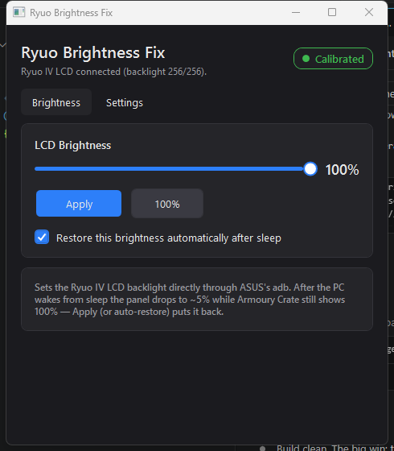

# ASUS Ryuo Commander

Fixes the **ASUS ROG Ryuo IV** AIO LCD that goes **dim after the PC wakes from sleep** — even though Armoury Crate still shows brightness at 100%.

A small Windows (.NET 8 / WPF) tray app that sets the LCD brightness back to your chosen level — automatically on every resume, or on demand from a slider.



---

## The bug, and the actual fix

The Ryuo IV's little screen is a **tiny Android device** (`cm16`). Its brightness is the Android kernel **backlight** node:

```
/sys/class/backlight/backlight/brightness     (range 0–256)
```

After the system resumes from sleep, that backlight drops to roughly **13/256 (~5%)** while Armoury Crate's UI still claims 100%. Nothing in Armoury Crate re-asserts it, so the panel stays dim.

The fix is to write the backlight back to full over **adb**. The Ryuo exposes an **ADB interface** (`MI_01`), the device grants **root** over adb, and ASUS already ships an `adb.exe`. This app drives exactly that:

```
adb shell "echo 256 > /sys/class/backlight/backlight/brightness"
```

> **Why not a USB/HID command?** Brightness is **not** a HID report on this device — changing the slider in Armoury Crate sends no USB command at all. It is purely an Android-side backlight setting, reachable only over adb. (Earlier capture/replay code in this repo was the wrong layer and is superseded by the adb approach.)

---

## Requirements

- Windows 10/11, **.NET 8** runtime (or the SDK to build).
- **ASUS Info Hub - ROG RYUO IV** installed — the app uses the `adb.exe` it ships at
  `C:\Program Files\ASUS Info Hub - ROG RYUO IV\bin\adb.exe`.
- The Ryuo IV AIO connected (so `adb` can see the `cm16` device).
- **No administrator rights required** — adb access is not privileged here.

---

## Using it

1. Build (below) and run `RyuoBrightnessFix.exe`.
2. **Brightness** tab: drag the slider and click **Apply**, or **100%** for full. Tick **"Restore this brightness automatically after sleep."**
3. **Settings** tab: tick **Start with Windows**, **Start minimized**, and **Show tray icon** so it runs silently in the tray and self-heals the brightness on every wake.

The header shows the live state, e.g. *"Ryuo IV LCD connected (backlight 256/256)"* with a green **Calibrated** badge when adb can reach the panel.

### Start in the tray only (no taskbar button)

In **Settings**, enable **Start minimized** + **Show tray icon**. The app then launches straight to the system tray with no window and no taskbar entry; double-click the tray icon to open it.

---

## How it works

| Piece | Role |
|-------|------|
| `BacklightService` | Runs ASUS's `adb.exe` (from its own folder so it finds `AdbWinApi.dll`) to read/write the backlight node. `SetPercent(p)` writes `round(p × 256 / 100)`. |
| `ResumeMonitor` | Subscribes to `SystemEvents.PowerModeChanged`; on resume, waits ~10 s then re-applies the target brightness. |
| `StartupRegistrationService` | "Start with Windows" via the per-user `HKCU\…\Run` key. |
| `TrayIconService` | System-tray icon + menu (open / restore brightness / exit). |
| `MainViewModel` / `MainWindow` | The slider, Apply, auto-restore, and Settings UI (MVVM, dark theme). |

---

## Manual adb commands (reference)

If you just want to do it by hand in PowerShell:

```powershell
cd "C:\Program Files\ASUS Info Hub - ROG RYUO IV"
.\bin\adb.exe get-state                                                          # -> device
.\bin\adb.exe shell cat /sys/class/backlight/backlight/brightness                # read (0–256)
.\bin\adb.exe shell "echo 256 > /sys/class/backlight/backlight/brightness"       # 100%
.\bin\adb.exe shell "echo 3   > /sys/class/backlight/backlight/brightness"       # ~1%
```

`cd` into that folder first — adb loads `AdbWinApi.dll` from there.

---

## Build

```powershell
dotnet build RyuoBrightnessFix.sln -c Release
```

Output: `src\RyuoBrightnessFix\bin\Release\net8.0-windows\RyuoBrightnessFix.exe`.

Dependencies (restored automatically): WPF, **Microsoft.Win32.SystemEvents** (resume detection), **Serilog** (logging to `%APPDATA%\RyuoBrightnessFix\logs\`).

---

## Notes / limitations

- This targets the **Ryuo IV** specifically (device `cm16`, backlight max **256**). Other ASUS LCDs may differ.
- It relies on ASUS Info Hub's bundled `adb.exe` and the device granting root over adb — both true on the Ryuo IV as shipped.
- The dim-after-sleep behaviour is ultimately an ASUS firmware/Armoury Crate bug; this app is a practical workaround.

## License

GNU AGPL v3 — see [LICENSE](LICENSE).
